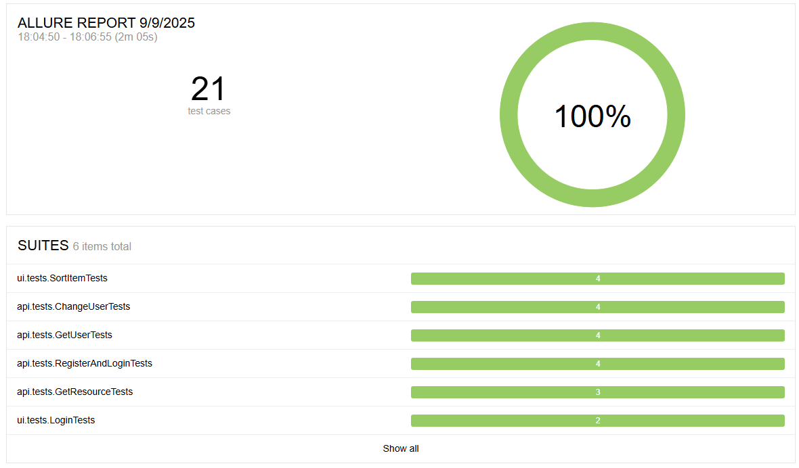
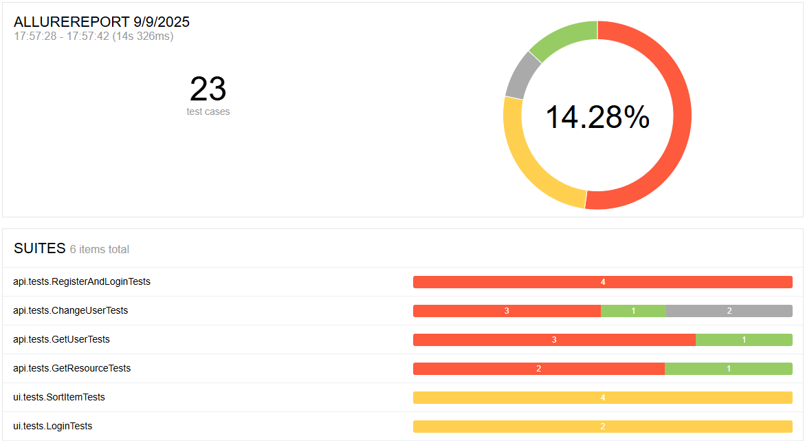
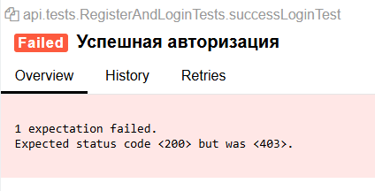
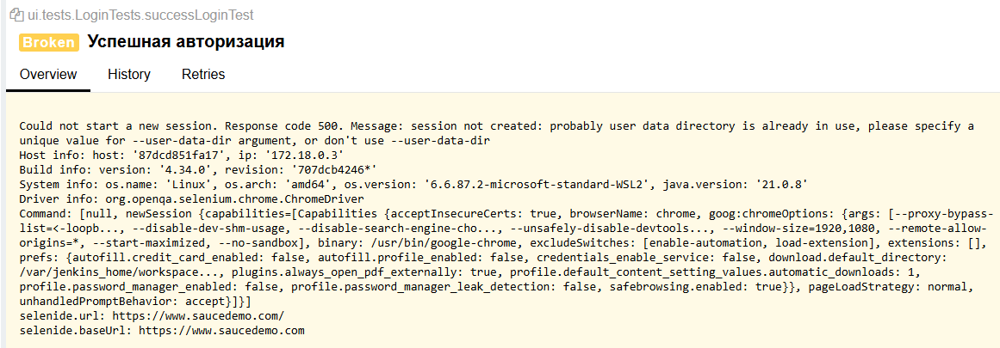

# Проект по автоматизации web (https://www.saucedemo.com) и api (https://reqres.in)
## Allure отчет при локальном запуске

> Иппользованые технологии: <code>Selenide</code>, <code>Rest Assured</code>, <code>Allure</code>, <code>Jenkins</code>

> При запуске в <code>Jenkins</code> возникает ряд ошибок

## Allure отчет при запуске в Jenkins

> При запуске подряд API тесты часто падают из-за ошибки авторизации со стороны сервера <code>reqres.in</code>, даже с добавленным в запрос ключем <code>'x-api-key'</code>
>
> Из-за чего в <code>Jenkins</code> они не проходят

 

> При запуске UI тестов в <code>Jenkins</code> появляется ошибка <code>Message: session not created</code>
>
> Путем поиска информации в гугле было выяснено, что ошибка возникает при работе с <code>Chrome</code> от имени администратора (<code>root</code>)
> 
> Пока ожидает исправления

 

